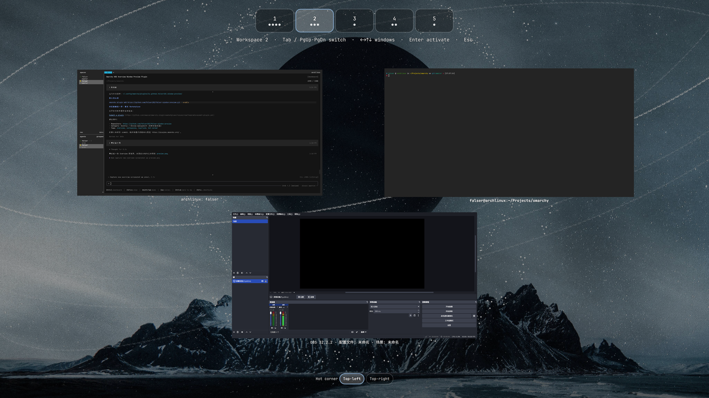

# Window Preview

KDE Overview–style window browser for [Omarchy](https://omarchy.org/) (Quattro shell).



## Features

- Browse window previews on the **current workspace**
- Switch workspaces from the top strip (Hyprland follows)
- Special workspaces such as the scratchpad get their own chip after the numbered ones
- Click / Enter a preview to focus that window and close overview
- **Responsive grid**: more windows → wrap + shrink to fit one screen
- Configurable **hot corner** (top-left or top-right)
- Theme wallpaper as the overview background

## Install

```sh
omarchy plugin add https://github.com/falser101/falser-window-preview.git --enable
```

Optional keybind in `~/.config/hypr/bindings.lua`:

```lua
o.bind("SUPER + SHIFT + A", "Window preview", "omarchy-shell shell toggle io.github.falser101.window-preview")
```

Then `hyprctl reload`.

### Update / remove

```sh
omarchy plugin update io.github.falser101.window-preview
omarchy plugin remove io.github.falser101.window-preview
```

## Usage

| Input | Action |
|-------|--------|
| Hot corner | Open / close overview |
| `omarchy-shell shell toggle io.github.falser101.window-preview` | Same via IPC |
| Workspace chips / `Tab` / `PgUp`·`PgDn` / `1`–`9` | Switch workspace |
| Arrow keys | Move selection |
| Type | Filter by title / app id |
| Enter / click | Activate window and exit |
| Middle-click / `Shift+Q` | Close selected window |
| Esc | Clear filter, then close |
| Footer: Top-left / Top-right | Choose hot corner |

## Configure

Hot corner settings live on the plugin entry in `~/.config/omarchy/shell.json`
(also editable from the overview footer):

```json
{
  "plugins": [
    {
      "id": "io.github.falser101.window-preview",
      "hotCornerPosition": "top-left"
    }
  ]
}
```

| `hotCornerPosition` | Meaning |
|---------------------|---------|
| `"top-left"` | Default |
| `"top-right"` | Right-top corner |

If another overview plugin uses the same corner, pick the other side.

## Requirements

- Omarchy Quattro with the native shell plugin system
- Hyprland (toplevel export for live thumbnails; fallback labels if blocked)

## License

MIT — see [LICENSE](LICENSE).
